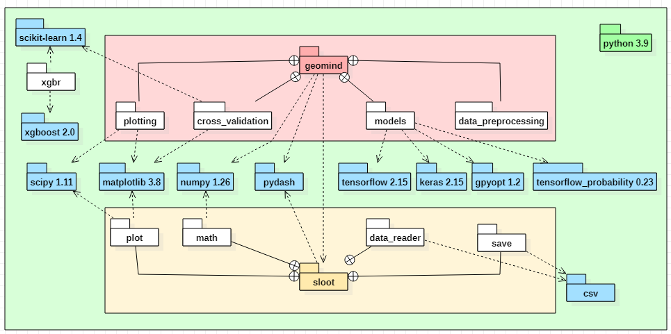

# GEOMIND

**GEOMIND: A hybrid generative artificial intelligence for geopolymer design and optimization**

GEOMIND is a machine-learning toolkit for designing geopolymer precursor mix proportions from target
material properties. Given desired fresh and consolidated properties, GEOMIND predicts
feasible formulations in terms of solutions, additives, and metakaolin precursors.

The core workflow is implemented in a Jupyter notebook (`GEOMIND.ipynb`) and a small
Python codebase organized into several directories.

---

## Table of contents

- [Overview](#overview)
- [Inputs and outputs](#inputs-and-outputs)
- [Repository structure](#repository-structure)
- [Installation](#installation)
- [Getting started](#getting-started)
- [Package modules](#package-modules)
- [Results and saved models](#results-and-saved-models)
- [Known limitations](#known-limitations)
- [Authors](#authors)
- [How to cite](#how-to-cite)
- [Project status and license](#project-status-and-license)

---

## Overview

GEOMIND combines data preprocessing and neural-network models to:

1. Read a geopolymer database (precursor proportions and corresponding properties).
2. Train GEOMIND neural-network models (Simulator, Formulator, Trainer) and comparative models.
3. Check feasibility of candidate mixtures via built-in constraints (Feasibility Controller).
4. Predict new formulations that match user-specified target properties.

To obtain a new precursor mix formulation from target material properties, simply open
and run the `GEOMIND.ipynb` notebook.

The original GEOMIND notebook can be found here:  
https://github.com/Geopolymer-AI/GEOMIND/blob/main/GEOMIND.ipynb

An architecture diagram of the current package (dependencies and modules) is provided
in the repository as:


```markdown

```

---

## Inputs and outputs

### Precursors

The formulation is expressed in terms of:

- **Solutions**
  - `S1`, `S3`, `SNa`, `S3'`
- **Additives**
  - `KOH`, `NaOH`
- **Metakaolins**
  - `M1`, `M2`, `M3`, `M4`, `M5`

These variables represent the precursor mix proportions (e.g. mass or molar fractions) used as model inputs/outputs.

### Properties

Target properties are typically divided into:

- **At fresh**
  - Initial viscosity (Pa·s)
  - Mixture density
- **Consolidated**
  - Compressive strength (MPa)
  - Density (g/cm³)

The **Formulator** part of GEOMIND takes these **target properties** and predicts a
**feasible precursor formulation**.

---

## Repository structure

The main branch currently contains:

```text
.
├── cross_validation/       # Cross-validation utilities for GEOMIND and comparative models
├── data/                   # CSV files with precursor compositions and properties
├── data_preprocessing/     # Data loading, cleaning and preprocessing for geopolymer datasets
├── models/                 # GEOMIND Simulator, Formulator, Trainer, Feasibility Controller
├── plotting/               # Histogram, heatmap and prediction plotting utilities
├── results/                # Training outputs, figures and prediction exports
├── GEOMIND.ipynb           # Main notebook: end-to-end workflow
└── GEOMIND_diagram_package.png  # Package architecture diagram
```

> **Note**: Ensure at least the `data/`, `results/` and `saved model` locations are
> correctly configured in the notebook before running large experiments.

---

## Installation

### Python and package requirements

- **Python**: 3.9

Required packages (tested versions):

- `scipy==1.11`
- `matplotlib==3.8`
- `numpy==1.26`
- `pydash`
- `xgboost==2.0`
- `scikit-learn==1.4`
- `keras==2.15`
- `tensorflow==2.15`
- `tensorflow_probability==0.23`
- `gpyopt==1.2`

You can install dependencies with `pip`.

#### Example (virtual environment + pip)

```bash
# Create and activate a virtual environment
python3.9 -m venv .venv
source .venv/bin/activate  # On Windows: .venv\Scripts\activate

# Install dependencies
pip install scipy==1.11 matplotlib==3.8 numpy==1.26 pydash             xgboost==2.0 scikit-learn==1.4 keras==2.15             tensorflow==2.15 tensorflow_probability==0.23             gpyopt==1.2
```

---

## Getting started

1. **Prepare the data**

   - Place at least one CSV file in the `data/` directory containing:
     - Precursor mix proportions (`S1`, `S3`, `SNa`, `S3'`, `KOH`, `NaOH`, `M1–M5`).
     - Corresponding fresh and consolidated properties.

2. **Launch Jupyter**

```bash
jupyter notebook
```

3. **Open and run the main notebook**

   - Open `GEOMIND.ipynb`.
   - Follow the notebook sections to:
     1. Load and preprocess the dataset.
     2. Visualize data with histograms and heatmaps.
     3. Train GEOMIND models (Simulator, Formulator, Trainer) and comparative models.
     4. Save trained models to the locations configured in the notebook.
     5. Query the Formulator with your **target properties** to obtain a **new precursor formulation**.
   - Figures and numerical results are written into the `results/` directory.

---

## Package modules

The code is organized into four main directories of Python modules:

### `models/`

- Classes for the GEOMIND neural-network models:
  - **Simulator** – predicts properties from given precursor mixes.
  - **Formulator** – predicts precursor mixes from target properties.
  - **Trainer** – handles training and evaluation of the models.
- Embedded **Feasibility Controller** functions to verify that proposed mixes satisfy
  process and domain constraints.

### `cross_validation/`

- Functions to perform cross-validation of:
  - GEOMIND models.
  - Comparative baseline models (e.g. traditional ML algorithms).

### `data_preprocessing/`

- Utilities for reading, cleaning and transforming:
  - Precursor data (solutions, metakaolins).
  - Property data (fresh and consolidated metrics).
- Ensures data are in the correct format and scaling for the GEOMIND models.

### `plotting/`

- Functions to generate:
  - Histograms.
  - Heatmaps.
  - Prediction plots for both properties and precursor compositions.

These modules are used directly by `GEOMIND.ipynb`; they can also be imported into
custom scripts for advanced workflows.

---

## Results and saved models

### `results/`

- Stores:
  - Training curves and logs.
  - Histograms and heatmaps.
  - CSV files of predicted properties and formulations.
  - Any auxiliary diagnostic plots.

### Saved models

- GEOMIND models are saved using **Keras** / **TensorFlow** from within the notebook.
- You can reload them to:
  - Perform additional predictions.
  - Fine-tune on new data.
  - Compare with new modeling approaches.

---

## Known limitations

- The tool currently targets **Python 3.9** and specific package versions.
  Using significantly different versions may require code adaptations.
- Data format and column naming must be consistent with the expectations in
  `data_preprocessing` and `GEOMIND.ipynb`. If you change the schema, you may need to
  adapt preprocessing functions.

---

## Authors

- **Sébastien Rousseau**¹ ²  
- **Assil Bouzid**¹  
- **Sylvie Rossignol**¹  
- **Ameni Gharzouni**¹
✉ ameni.gharzouni@unilim.fr

¹ Institut de Recherche sur les Céramiques, UMR 7315 CNRS - Université de Limoges,  
Centre Européen de la Céramique, 12 rue Atlantis, 87068 Limoges Cedex, France.  

² XLIM, UMR CNRS 7252, 16 Rue Jules Vallès, 19100 Brive La Gaillarde, France.

---

## How to cite

If you use GEOMIND or derivations of this repository in academic work or industrial
reports, please cite:

> S. Rousseau, A. Bouzid, S. Rossignol and A. Gharzouni,  
> **"GEOMIND: A hybrid generative artificial intelligence for geopolymer design and optimization"**,  
> Institut de Recherche sur les Céramiques (IRCER) – 2025.

---

## Project status and license

- **Status**: Research / prototype.
- **License**: This project is released under the **MIT License**.

